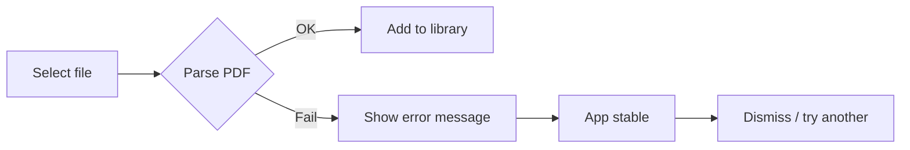

# UX Design Specification – AuditLab

**Author:** Hajoonkim
**Date:** 2025-03-02

---

## Executive Summary

### Project Vision

AuditLab turns PDFs into structured, navigable, audible content so users can manage a paper library, build playback queues, and listen with transcript and figure support. The vision is full workflow: organize, sort, export, and share papers and transcripts—not just listen. The app follows Apple HIG for a native iOS feel, with accessibility (VoiceOver, Dynamic Type) as a first-class concern from the start.

### Target Users

- **Researchers, students, professionals** who need to work with papers efficiently—add PDFs, organize in folders, queue, listen with a chosen voice, and resume from History.
- **Visually impaired users** who rely on VoiceOver; success means full flows (add, folders, queue, play, History) without sighted help, with clear labels, logical focus order, and adequate tap targets.
- **Evaluators / portfolio reviewers** who judge in ~30 seconds whether the app and code show clean architecture, thoughtful persistence, and production-ready iOS patterns.

### Key Design Challenges

- **Many-to-many folders and mental model:** Users must understand that one document can live in multiple folders; folder and library UIs must make add/remove and membership obvious without clutter.
- **Dual audience (sighted and VoiceOver):** Same flows must work for both; layout, labels, order, and feedback need to serve visual and non-visual use without duplication or conflict.
- **State and persistence visibility:** Library, queue, folders, voice, and playback position persist; users need clear feedback when state changes (e.g. "Added to folder", "Added to queue") and trust that data survives restart.
- **Error and edge states:** Malformed PDFs, empty library/queue/folder, and loading states need intentional, accessible patterns so the app never feels broken or blank.

### Design Opportunities

- **History as a first-class tool:** Search and filter (date, document, folder) plus resume-from-position can make AuditLab the single place to continue research across sessions—differentiator vs. generic PDF readers.
- **Accessibility as product identity:** VoiceOver-first design and consistent labels/order can make the app the obvious choice for visually impaired users and signal quality to all users.
- **30-second evaluator story:** Clear folder structure, many-to-many visibility, voice selection, and History with resume can communicate "clean, persistent, accessible" in one short demo.

---

## Core User Experience

### Defining Experience

The core loop is **organize → queue → listen → resume**: add PDFs, put them in folders (including one doc in many folders), build a queue, listen with a chosen voice, and later find and resume from History. Many-to-many folders and resume-from-last-position must feel reliable and obvious. The experience should feel native to iOS—SwiftUI and Apple Human Interface Guidelines first, with minimal custom views or styling so the app stays consistent with the Apple ecosystem and accessible by default.

### Platform Strategy

- **Platform:** iOS only (SwiftUI, touch). Offline-first; no backend.
- **UI philosophy:** Prefer system components and system behaviors. Minimal custom views or custom styling; leverage SwiftUI and HIG so the app feels at home on iOS and benefits from system accessibility (VoiceOver, Dynamic Type).
- **Leverage system:** Document picker, system voice list, system colors and typography, semantic roles, and platform accessibility APIs. Avoid one-off custom UI that diverges from HIG.

### Visual Identity & Theming

- **Single style:** One consistent visual style across the app. No user-selectable themes or appearance options. The app uses system semantic colors and follows HIG; no custom accent (e.g. no princess pink).
- **Dark mode:** Supported. The app respects system appearance (light/dark) so it looks correct in both; no in-app toggle for appearance—users rely on system settings.
- **No theme options:** No Appearance control, no Accent control, no theme picker in Settings. Keeps implementation and UX simple; one style, one source of truth (system + semantic roles).

### Effortless Interactions

- Adding a PDF and seeing it in the library; adding a doc to a folder and getting clear feedback; building a queue from a folder; starting playback with the chosen voice; opening History and resuming from the last sentence.

### Critical Success Moments

- After restart: library, queue, folders, and voice are still there.
- A VoiceOver user completes add → folders → queue → play without sighted help.
- An evaluator sees many-to-many, persistence, voice, and History in ~30 seconds—clean, native, accessible.

### Experience Principles

1. **One place for research:** Organize, queue, listen, and resume in one app—no re-finding or re-adding.
2. **Native and accessible:** HIG-aligned, SwiftUI-first, minimal custom UI; same flows work for sighted and non-sighted users.
3. **State is visible and durable:** Clear feedback on actions; data and preferences (e.g. voice) survive restart.
4. **Graceful failure:** Bad PDFs and empty states handled with clear messages and recovery.

---

## Desired Emotional Response

### Primary Emotional Goals

- **In control and at home:** "My papers, my queue, my voice—everything stays where I put it." Library, folders, and queue feel like *their* space.
- **Relieved and continuous:** No re-finding or re-adding; resume from History removes the "where was I?" friction.
- **Seen and capable:** Accessible by default (VoiceOver, labels, focus order) so everyone can complete the same flows.

### Emotional Journey Mapping

- **First use:** Curious and oriented—familiar iOS patterns and clear tabs (Library, Queue, History, Settings) so they know where to go.
- **Core loop (add → folders → queue → listen):** Confident—clear feedback ("Added to folder", "Added to queue"), no guesswork.
- **After a session:** Satisfied and continuous—they can leave and return without losing progress or redoing setup.
- **When something fails (e.g. bad PDF):** Reassured—clear message and recovery, no crash or dead end.
- **Returning later:** Trusting—library, folders, and voice are still there.

### Micro-Emotions

- **Confidence over confusion:** Obvious actions and feedback; many-to-many folders stay simple (KISS).
- **Trust over skepticism:** Persistence and graceful failure show the app is reliable.
- **Accomplishment over frustration:** Completing the loop (add → organize → listen → resume) feels doable and repeatable.

### Design Implications

- **In control:** Visible state (e.g. queue contents, folder membership) and clear Settings (voice, etc.).
- **Relieved/continuous:** Resume from History and "last position" surfaced clearly; empty and loading states explained, not blank.
- **Seen/capable:** Accessibility labels, order, and feedback designed in from the start; contrast checked for readability.
- **Trust:** Error messages that explain and offer next steps; no silent failures.

### Emotional Design Principles

1. **Clarity over cleverness:** Every action has obvious feedback; flows are predictable.
2. **Durability:** Data and preferences survive; the app "remembers" the user.
3. **Inclusion:** Same flows work with VoiceOver; dark mode supported via system appearance.

---

## UX Pattern Analysis & Inspiration

### Inspiring Products Analysis

- **Apple Books / Apple Podcasts:** Clear library vs. "now playing," simple queue, system typography and list styles. Good fit for "library + playback" and "one place for my stuff."
- **Apple Music / Apple Podcasts:** Add to library, playlists (like folders), queue, resume. Familiar tab model (Library, Browse, etc.) and system controls.
- **Files:** Folder hierarchy, "add to folder," multi-select. Reuse ideas for "one doc in many folders" without copying layout.
- **Apple Settings:** Clear sections, minimal custom UI; app follows system appearance (no in-app theme).
- **Strong VoiceOver apps (e.g. Apple first-party):** Consistent labels, logical order, no custom widgets that break accessibility. Supports "seen and capable."

### Transferable UX Patterns

- **Navigation:** Tab bar (Library, Queue, History, Settings) for primary areas; lists and grouped content inside each.
- **Interaction:** Standard add/remove, reorder, and "play from here" patterns; clear confirmation (e.g. "Added to folder").
- **Visual:** Semantic colors (system accent for actions, neutral backgrounds); system list/grouped styles. No custom theming; one style, dark mode via system.

### Anti-Patterns to Avoid

- Heavy custom chrome that diverges from HIG (hard to maintain, often worse for accessibility).
- Custom accent or theme options (we use one style, system-driven).
- Silent failures or generic errors for bad PDFs; blank or unexplained empty/loading states.

### Design Inspiration Strategy

- **Adopt:** Tab-based primary navigation; system list/grouped styles; system semantic colors; explicit feedback for add/remove/queue; follow system appearance (dark mode).
- **Adapt:** "Folder" = tag-like membership (one doc, many folders); queue = simple ordered list with play-from-here; History = searchable/filterable list with resume.
- **Avoid:** Custom navigation paradigms; user theme/accent options; non-HIG patterns.

---

## Design System Foundation

### Design System Choice

**Apple Human Interface Guidelines (HIG) + SwiftUI system components.** No theming layer; one style only.

- **Foundation:** Native SwiftUI controls and layouts (List, Form, TabView, NavigationStack, etc.), HIG layout and typography, and system accessibility behavior.
- **No theme options:** No user-selectable appearance or accent. App uses system semantic colors and follows system light/dark appearance. No custom accent (no princess pink); no Appearance or Accent controls in Settings.

### Rationale for Selection

- Matches your goals: SwiftUI, HIG, system-heavy, minimal custom views, one style, dark mode supported via system.
- Keeps the app native, accessible (VoiceOver, Dynamic Type), and maintainable with no theme logic.

### Implementation Approach

- Use **system components** for navigation, lists, forms, buttons, and controls.
- Rely on **system semantic colors** and asset catalog only where needed for light/dark variants (e.g. grouped backgrounds). No custom accent colors; no theme/appearance model.
- **Settings:** Voice, speech rate, clear history, app version, etc. No Appearance or Accent controls; app follows system appearance.

### Customization Strategy

- **Do:** HIG-aligned spacing/typography; system colors; support system dark mode.
- **Don't:** User theme options, custom accent colors, or in-app appearance/accent pickers.

---

## Defining Core Interaction

### Defining Experience

The core interaction users can describe in one line: **"Add my PDFs, put them in folders, build a queue, listen with my chosen voice, and later pick up from History—all in one app."** The "one place" for research: no re-finding, re-adding, or juggling other apps. If that loop feels reliable and obvious, the product wins.

### User Mental Model

- **Current problem:** People use generic readers + separate TTS or manual note-taking; papers, queue, and listening position live in different places.
- **Expectation:** "I add a paper once, I organize it, I listen, and when I come back I continue from where I was." Folders = "my groups" (one doc can be in several). Queue = "what I'm playing next." History = "where I left off."
- **Confusion risks:** Many-to-many (same doc in multiple folders) must be clear.

### Success Criteria

- User adds a PDF and sees it in the library; adds it to a folder and gets clear feedback ("Added to folder").
- User builds a queue (from list or folder) and starts playback with their chosen voice.
- User returns later, opens History, and resumes from the last position without re-adding or re-queuing.
- After app restart, library, folders, queue, and voice are unchanged.
- VoiceOver user completes the full flow (add → folders → queue → play → History) without sighted help.

### Novel vs. Established Patterns

- **Mostly established:** Tab bar (Library, Queue, History, Settings), list/grid for library and queue, add/remove, play/pause, Settings for voice (no appearance/theme controls). Same patterns as Books, Podcasts, Music.
- **Adaptation:** "Folders" = tag-like membership (one doc in many folders), not a single hierarchy. "Resume from History" = first-class, not buried.
- **No new paradigm:** No novel gesture or interaction to learn; clarity and reliability are the differentiator.

### Experience Mechanics

1. **Start:** Open app → see Library (and/or Queue). Add PDF via document picker; add folder via header action.
2. **Organize:** Tap doc → add to folder(s); same doc can appear in multiple folders. Tap folder → see its docs; add folder to queue (snapshot).
3. **Listen:** Tap play (from library, queue, or history). Transcript and position visible; voice from Settings applied. Pause/resume; position persisted.
4. **Return:** History tab → search/filter → tap entry → resume from last position.
5. **Feedback at each step:** "Added to library," "Added to folder," "Added to queue," playback state, error message if PDF fails—all clear and, where relevant, announced.

---

## Visual Design Foundation

### Color System

- **Single style:** One consistent look. No user theme or accent options. Use **system semantic colors** (e.g. accent, background, grouped background, label primary/secondary) so the app follows HIG and respects system light/dark.
- **Dark mode:** Supported by following system appearance. Provide light/dark variants only where needed (e.g. asset catalog for custom surfaces); no in-app appearance toggle.
- **Semantic feedback colors:** Define Success, Warning, and Destructive roles (with light/dark variants) for toasts, alerts, and actions—so feedback states are consistent and accessible.
- **Empty and loading states:** Use the same semantic backgrounds and neutral text; no ad-hoc colors. Keeps the foundation complete for implementation.
- **Accessibility:** Contrast ratios meet WCAG (e.g. 4.5:1 body, 3:1 large/UI). Never rely on color alone; pair with labels, icons, or structure.

### Typography System

- **Foundation:** **System typography** (SwiftUI `Font.body`, `.headline`, `.subheadline`, etc.) so the app respects Dynamic Type and platform accessibility.
- **Scale:** Use semantic styles (title, headline, body, caption); layout and hierarchy scale with user text-size settings.
- **Tone:** Clear and readable for both short labels and longer transcript/History content.

### Spacing & Layout Foundation

- **HIG alignment:** Use system spacing (SwiftUI spacing and insets, `List`/`Form` grouping, safe areas). Prefer system or a small set of tokens (e.g. 8pt / 16pt) if needed.
- **Density:** Balanced—enough padding for tap targets and readability; enough content visible in library, queue, and History. Grouped list style for settings and structured content.
- **List rows and cards:** Sufficient internal padding for tap targets; grouped content (e.g. folder list, queue) has clear visual grouping.
- **Grid/layout:** Standard list and grid patterns; respect Dynamic Type so layout doesn’t break at larger sizes.

### Hierarchy Principle

- **Structure over color:** Primary actions use system accent; secondary text and metadata use secondary label color. Hierarchy comes from **type weight and spacing** as well as color, so layout reads in grayscale or for color-blind users.
- **One accent at a time:** Use system accent for primary actions; avoid mixing multiple strong accents in the same view.

### Accessibility Considerations

- **Color:** Never rely on color alone; use labels, icons, or structure. All feedback colors checked for contrast in light and dark.
- **Typography:** Dynamic Type supported; no fixed font sizes that block scaling.
- **Touch targets:** Minimum ~44pt for interactive elements; use system controls and spacing.
- **VoiceOver:** All interactive elements have accessibility labels; order and feedback align with emotional goals (e.g. "Added to folder" announced).

---

## Design Direction Decision

### Design Directions Explored

Single direction only—no theme or accent variations. Native iOS, system components, one style, dark mode supported via system appearance.

### Chosen Direction

**HIG + SwiftUI, one style:** Tab bar (Library, Queue, History, Settings); list and grouped content; system semantic colors and typography; spacing and hierarchy per Visual Design Foundation. Layout follows the spec (library list/grid, queue list, History search/filter, Settings for voice etc.). No custom accent; no user theme options.

### Design Rationale

Aligns with the decision to bypass all theming: one style, dark mode, no theme options. Keeps implementation and UX simple and consistent with the rest of the specification.

### Implementation Approach

Build to the Visual Design Foundation and Design System Foundation already documented. No separate design-direction showcase; the single direction is the default and only option.

---

## User Journey Flows

### 1. Primary User – Success Path

*Goal:* Add PDFs → organize in folders → build queue → listen with chosen voice → later resume from History.

```mermaid
flowchart LR
  A[Open App] --> B[Library tab]
  B --> C[Add PDF]
  C --> D[Doc in library]
  D --> E[Add to folder(s)]
  E --> F[Build queue]
  F --> G[Tap Play]
  G --> H[Listen + transcript]
  H --> I[Pause / leave]
  I --> J[History tab]
  J --> K[Search / filter]
  K --> L[Tap Resume]
  L --> H
```

- **Entry:** Library tab; Add PDF (document picker); Add folder (header).
- **Decisions:** Which folders to add doc to; what to add to queue (doc or folder snapshot).
- **Feedback:** "Added to library," "Added to folder," "Added to queue," playback state.
- **Success:** Queue plays with chosen voice; later resume from History from last position.
- **Errors:** Bad PDF → clear message, no crash; empty states for library/queue/folder.

### 2. Visually Impaired User – Accessibility Journey

*Goal:* Same flow as primary (add → folders → queue → listen → History) using VoiceOver only.

- **Entry:** Same; every control has an accessibility label; focus order follows visual flow.
- **Feedback:** State changes announced ("Added to folder," "Playing," "Paused").
- **Success:** Full flow completed without sighted help; Dynamic Type and tap targets supported.
- **Flow:** Same as primary; difference is consistent labels, order, and announcements.

### 3. Edge Case – Malformed / Bad PDF



- **Entry:** User selects file in picker.
- **Feedback:** Clear error (e.g. "Couldn't read this PDF. It may be corrupted or unsupported.").
- **Recovery:** No crash; library/queue/folders unchanged; user can dismiss and try another file.

### 4. Edge Case – Resume From Last Position

- **Entry:** History tab → search/filter → tap entry.
- **Flow:** "Resume" (or equivalent) → playback from stored position with same voice/settings.
- **Success:** Continuity across sessions; no re-finding or re-adding.

### 5. Returning User ("Future Self")

- **Entry:** Open app after days/weeks.
- **Flow:** Library and folders intact; voice preference unchanged; History searchable by document/date; tap resume on a paper to continue.
- **Success:** No re-import or re-setup; app feels stable and long-term.

### 6. Evaluator / Portfolio Review (30-Second Scan)

- **Flow:** Open app → see library/folders → add PDF → add to two folders → see in both → play → Settings (voice) → History (search, resume). Dark mode and native SwiftUI visible.
- **Success:** In ~30 seconds: many-to-many, persistence, voice, History, clean and accessible.

### Journey Patterns

- **Navigation:** Tab bar for primary areas; list/detail and sheets for add/play/settings.
- **Decisions:** Add to folder (multi-select); add to queue (doc or folder snapshot); resume from History.
- **Feedback:** Explicit confirmation for add/remove/queue; playback state; errors with recovery.

### Flow Optimization Principles

- Minimize steps to value: add → organize → play in few taps; resume from History in one tap.
- Clear feedback at each step; no silent state changes.
- Graceful failure: errors explained; empty and loading states intentional.

---

## Component Strategy

### Design System Components (Foundation)

Use SwiftUI and system controls as the primary building blocks:

- **Navigation:** `TabView` (Library, Queue, History, Settings), `NavigationStack`, toolbar.
- **Lists & structure:** `List`, `Form`, `LazyVGrid` (e.g. library/folders), sections and grouping.
- **Actions:** `Button`, `Menu`, context menus; document picker for Add PDF.
- **Feedback:** `Alert`, toasts/banners (e.g. "Added to folder"), `ProgressView` for loading.
- **Input/settings:** `Picker`, `Toggle`, sliders for voice/rate; standard Settings-style layout.
- **Layout:** `VStack`/`HStack`, `ScrollView`, safe area and system spacing.

No custom design system; these are the foundation components.

### Custom Components (Minimal)

Only where system components don't cover the need:

| Component | Purpose | Notes |
|-----------|---------|--------|
| **Transcript + current sentence** | Show transcript and highlight current sentence during playback | Custom view (or list + highlight); VoiceOver announces position. |
| **Figure panel** | Show figure(s) for current position during playback | Custom container; system image/async image where possible. |
| **Queue list (reorderable)** | Queue with reorder, remove, play-from-here | Build on `List` + reorder APIs; custom only if behavior is special. |
| **Library/folder cards** | Card for doc or folder in grid/list | Prefer `List`/cell or simple view; keep layout HIG-aligned. |
| **Empty / loading states** | Empty library, queue, folder; parsing/loading | Use semantic background + text (and optional system symbol); no custom chrome. |

### Component Implementation Strategy

- Prefer **system components** for navigation, lists, forms, buttons, and settings.
- Add **custom views** only for: transcript + highlight, figure context, and any queue reorder UX that can't be done with stock list behavior.
- Reuse **semantic colors and spacing** from the Visual Design Foundation; no custom component library or tokens beyond what's already specified.
- **Accessibility:** Labels and order for every interactive element; transcript/figure and playback state exposed for VoiceOver.

### Implementation Roadmap

- **Phase 1 – Core:** Tab structure, Library (list/grid + add PDF, add folder), Queue (list, add/remove, play), basic Player (play/pause, transcript area, figure area), Settings (voice, etc.). Use system components; add minimal custom views for transcript highlight and figure panel.
- **Phase 2 – History & polish:** History (search, filter, list, resume), empty/loading states, error handling (e.g. bad PDF alert).
- **Phase 3 – Refinement:** Reorder queue, any remaining accessibility and layout polish.

---

## UX Consistency Patterns

### Button Hierarchy

- **Primary:** One main action per context (e.g. "Add PDF," "Play," "Resume"). Use system accent; default `Button` or prominent style.
- **Secondary:** Supporting actions (e.g. "Add to folder," "Add to queue"). Use secondary or bordered style; avoid competing with primary.
- **Destructive:** Delete/remove. Use system destructive role; require confirmation where data is lost.
- **Tertiary:** Low emphasis (e.g. "Cancel," "Dismiss"). Text or subtle style. No custom styling beyond system.

### Feedback Patterns

- **Success / confirmation:** Short, dismissible (e.g. "Added to folder," "Added to queue"). Prefer banner/toast or inline; announce for VoiceOver. Use semantic Success when applicable.
- **Error:** Clear message + next step (e.g. "Couldn't read this PDF…" + dismiss). Use semantic Error/Warning; no crash. Announce for VoiceOver.
- **Loading:** `ProgressView` or equivalent for parsing/add; show within ~500 ms for longer operations. No custom spinners beyond system.
- **Empty state:** Message + optional action (e.g. "No documents. Add a PDF to get started."). Same semantic background; optional system symbol.

### Form Patterns

- **Settings:** Grouped `List`/`Form`; sections (Voice, History, About). Use `Picker`, `Toggle`, sliders; labels and values clear. No theme/appearance controls; follow system.
- **Validation:** Inline or alert; one place. Don't block without explaining what to fix.

### Navigation Patterns

- **Primary:** Tab bar (Library, Queue, History, Settings). One tab = one root; no nested tabs.
- **Drill-down:** `NavigationStack`; back = system back. Title reflects context (e.g. folder name, document title).
- **Sheets:** Add PDF (picker), Player (playback), optional folder-picker. Dismiss = swipe or button; consistent with HIG.
- **Context menus:** Long-press on doc/folder/queue item for add-to-folder, add-to-queue, remove, etc. Keep actions scoped and labeled.

### Additional Patterns

- **Search/filter:** `.searchable` in History (and library if needed); filters (date, document, folder) as chips or segmented control. Results update as user types; clear "no results" state.
- **List actions:** Swipe or context menu for remove/reorder where applicable (e.g. queue). Standard list reorder APIs; labels for VoiceOver.
- **Playback state:** Visible play/pause and position; state changes announced. Transcript highlight and figure panel follow component strategy.

---

## Responsive Design & Accessibility

### Responsive Strategy

- **Scope:** iOS app (iPhone primary; iPad if the app is universal). No web or desktop.
- **Approach:** Use **SwiftUI and system layout** (stacks, `List`, `ScrollView`, safe areas). Let the system handle size classes and traits; use `@Environment(\.horizontalSizeClass)` (or equivalent) only where layout must change (e.g. compact vs regular).
- **Density:** Same content and flows on all supported sizes; list/grid and spacing scale with Dynamic Type and safe area. No separate "mobile vs tablet" design; one layout strategy that adapts.

### Breakpoint Strategy

- **Breakpoints:** Use **iOS size classes** (compact / regular) rather than pixel breakpoints. Design for compact width (iPhone portrait) first; then ensure regular width (e.g. iPad or iPhone landscape) doesn't break.
- **No web breakpoints:** Pixel-based breakpoints (320px, 768px, etc.) do not apply; layout is driven by SwiftUI and size classes.

### Accessibility Strategy

- **Target:** **WCAG 2.1 Level AA** where applicable to native iOS (contrast, touch targets, labels, focus).
- **VoiceOver:** All interactive elements have `.accessibilityLabel` (and `.accessibilityHint` where helpful). Logical order; state changes announced (e.g. "Added to folder," "Playing").
- **Dynamic Type:** Support up to largest accessibility sizes; no clipping or overlap; layout adjusts.
- **Touch targets:** Minimum ~44pt; use system controls and spacing.
- **Color:** Don't rely on color alone; use labels, icons, or structure. Contrast meets 4.5:1 for body text, 3:1 for large text and UI (system colors + dark mode support).
- **Reduce Motion / other settings:** Respect system accessibility settings where applicable.

### Testing Strategy

- **Responsive:** Run on multiple iPhone sizes (and iPad if universal); check compact vs regular; rotate device where relevant.
- **Accessibility:** VoiceOver on device; Dynamic Type at largest sizes; automated audit (e.g. Xcode Accessibility Inspector). Test critical paths: add PDF, folders, queue, play, History, Settings.
- **Inclusive testing:** Include VoiceOver users or accessibility reviewers if possible.

### Implementation Guidelines

- **Layout:** Prefer `List`, `Form`, and system containers; use semantic spacing and alignment. Avoid fixed widths that break with Dynamic Type or size class changes.
- **Accessibility:** Set `accessibilityLabel` (and hint/value) on every interactive view; group related content; expose playback position and state to VoiceOver.
- **Contrast:** Use semantic colors with light/dark variants; check text and controls in both modes.

---

<!-- UX design content will be appended sequentially through collaborative workflow steps -->
